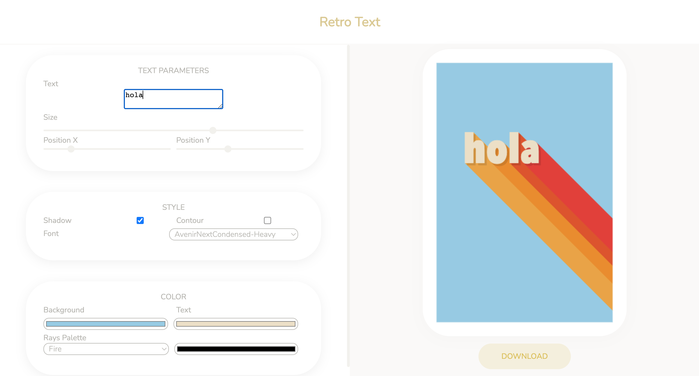

# Retro Text

Retro Text is a user-friendly web tool powered by p5.js, allowing you to effortlessly generate captivating text designs with a charming retro vibe. With customizable options for fonts, contourns, shadows and colors, Retro Text empowers you to design website headers, social media posts, or artwork.

## Getting Started

To get started, simply open the ´index.html´ file in your web browser and begin adjusting the parameters using the sliders and buttons provided. You can also save your favorite patterns by clicking the "Download" button, which will generate a PNG image file that you can download and use as desired.

## Usage

The GUI provides a range of customizable parameters for generating the design. Experiment with these parameters to unleash your creativity and achieve the perfect vintage look for your text designs.

#### Text
- Text: Enter the desired text for your design.
- Size: Adjust the size of the text.
- Position X: Control the horizontal placement of the text on the canvas.
- Position Y: Control the vertical placement of the text on the canvas.

#### Style
- Shadow: Add a shadow effect to enhance the depth of your text.
- Contour: Apply a contour effect to give your text a distinct outline.
- Font: Choose from a selection of retro-inspired fonts to match your design aesthetic.

#### Color
- Background: Set the background color of the canvas to create contrast or complement the text.
- Text: Choose the color of the text itself to make it pop or blend harmoniously with the background.
- Rays Palette: Customize the color palette of the trail effect to create a unique and captivating visual trail behind the text.